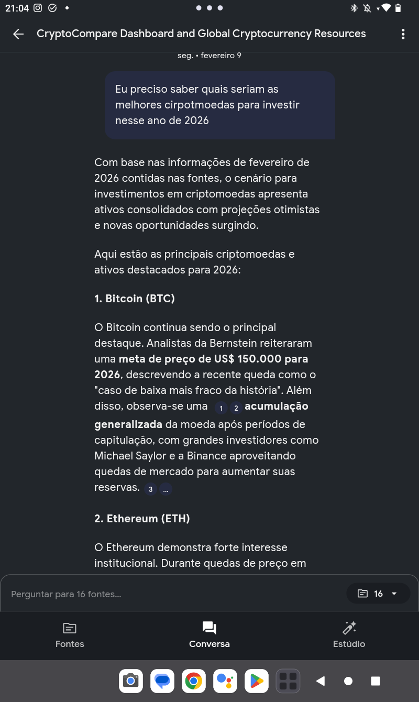
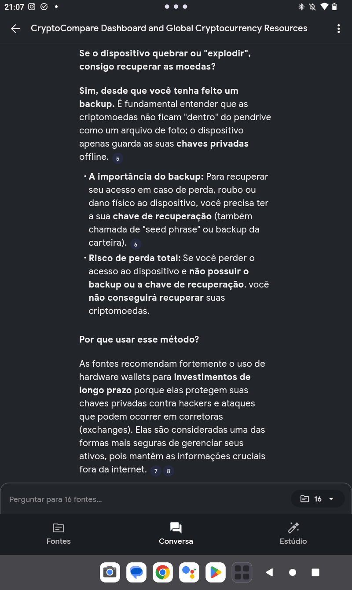

```Markdown

# Projeto da Digital Inovation One - Criação de agente com notebooklm
🏔️☁️

agente de criptomoedas - Informações e imvestimento 💰💲🏦

O projeto foi voltado para criacão de um agente no notebooklm
sobre investimento pegando de 3 a 5 fontes para usar
como referência de dado, sendo instruido pelo mentor
Felipe Aguiar da Digital Inovation. O material escolhido
para serem as fontes de dados serão utilizados para
elaborar perguntas estratégicas, registrando respostas de acordo
com a preferência do usuário. 

O intuito é usar a IA como ferramenta auxiliar para ajudar
no pensamento crítico e organizando o conhecimento.

Segue abaixo o modelo criado pelo NotebookLMcomoprint das perguntas e respostas gerado por esse agente.

```


Aqui eu comecei perguntando sobre as melhores criptomoedas 
para o ano de 2026, aquelas mais promissoras.




Aqui a pergunta foi refente a guardar criptomoeda em pendrive e se possui algum risco de perder o que tá ali caso queime o pendrive ou se acontecer qualquer coisa ruim com ele.


continuação e finalização das perguntas.




como conclusão o notebooklm pode ser usado para criar vários agentes em assuntos determinados pelo usuário
ajudando em estudos, compreendendo assuntos complexos em prompts simples. assim, economizando muito tempo com pesquisas.
O tempo deve ser voltado para procurar boas fomtes de dados porque o notebooklm trabalha com dados. podendo escolher em videos, ebook (pdf), áudio, texto copiado, imagem e sites.quanto melhor as fontes melhor será a resposta gerada pelo o agente.
